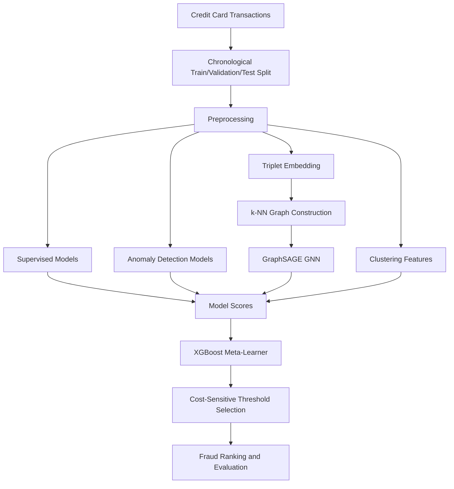

# Financial_Fraud_Detection_Capstone_Study

### Credit Card Fraud Detection with Supervised ML, Anomaly Detection, Metric Learning, GNNs, and Cost-Aware Evaluation


</div>

---

## Overview

This project explores **credit card fraud detection** on a highly imbalanced financial transaction dataset using a wide range of machine learning approaches, including supervised models, anomaly detection, metric learning, graph neural networks, clustering diagnostics, and cost-sensitive meta-learning.

The goal is not just to classify transactions as fraudulent or legitimate. In a real financial-risk setting, the more important question is:

> **Can we rank transactions by fraud risk so that a small manual-review budget catches as much fraud as possible?**

Because fraudulent transactions make up only about **0.17%** of the dataset, standard accuracy is not useful. This project focuses on metrics that matter for imbalanced fraud detection, such as **PR-AUC**, **ROC-AUC**, **recall at review budget**, and **expected business cost**.

---

## Business Problem

Banks and payment processors cannot manually investigate every transaction. A useful fraud model must prioritize the riskiest transactions while minimizing false alarms and missed fraud.

This project answers three practical questions:

1. Which models rank fraudulent transactions most effectively?
2. How much fraud can be recovered if only the top-risk transactions are reviewed?
3. Can a cost-sensitive meta-model reduce operational cost even if it does not have the highest PR-AUC?

---

## Dataset

The project uses the **European Credit Card Fraud Detection** dataset.

| Property | Description |
|---|---|
| Rows | 284,807 transactions |
| Features | 31 columns |
| Target | `Class` |
| Fraud label | `1` |
| Legitimate label | `0` |
| Fraud rate | ~0.17% |
| Feature types | `Time`, `Amount`, and anonymized PCA features `V1` to `V28` |

The dataset is sorted by transaction time and split chronologically:

```text
Train:      80%
Validation: 10%
Test:       10%
```

A chronological split is used to better simulate a real deployment scenario, where future transactions should not influence model training.

---

## Project Pipeline



---

## Methodology

### 1. Data Preprocessing

The preprocessing stage includes:

- Sorting transactions by `Time`
- Creating an 80/10/10 chronological split
- Applying `log1p(Amount)` to reduce skew in transaction amount
- Standardizing features using training-set statistics only
- Keeping validation and test distributions unchanged
- Handling severe class imbalance during selected model training

---

### 2. Supervised Learning Models

The project benchmarks a broad set of supervised machine learning models:

- Logistic Regression
- Linear SVM
- Naive Bayes variants
- Decision Tree
- Random Forest
- AdaBoost
- Gradient Boosting
- XGBoost
- LightGBM
- k-Nearest Neighbors
- Radius Neighbors
- RBF SVM
- Polynomial SVM
- Gaussian Process Classifier
- Calibrated Multi-Layer Perceptron

The strongest standalone models were tree ensembles and the calibrated MLP.

---

### 3. Metric Learning

A triplet-loss neural network was trained to learn a compact embedding space where fraudulent and legitimate transactions are better separated.

The learned embeddings were used for:

- k-NN style risk scoring
- Neighbor-risk priors
- Graph construction for GraphSAGE
- Clustering-based feature generation

---

### 4. Graph Neural Network

A GraphSAGE-style graph neural network was tested by converting transactions into nodes and connecting them through k-nearest-neighbor relationships.

Graph construction strategies included:

- Mutual k-NN graphs
- Temporal k-NN graphs
- Validation and test nodes connected to nearby training nodes

The GNN was implemented using PyTorch and PyTorch Geometric. Although the GNN was technically successful as an experiment, it performed poorly compared with simpler supervised models. This was an important negative result: synthetic k-NN graphs over tabular features did not provide strong relational structure for this dataset.

---

### 5. Unsupervised Anomaly Detection

Fraud was also modeled as an outlier-detection problem using:

- Isolation Forest
- Local Outlier Factor
- One-Class SVM
- Elliptic Envelope
- PCA reconstruction error
- Autoencoder reconstruction error

These methods were generally weaker as standalone fraud detectors, but their anomaly scores were useful as additional risk signals for the meta-learner.

---

### 6. Clustering Features

Clustering was used to identify regions of transaction space with elevated fraud concentration.

Methods explored included:

- MiniBatchKMeans
- Bayesian Gaussian Mixture
- Gaussian Mixture Models
- Spectral Clustering
- Agglomerative Clustering
- HDBSCAN
- OPTICS
- MeanShift

Generated clustering features included:

- Distance to assigned cluster centroid
- Cluster size
- Local fraud rate
- Negative log-likelihood
- Posterior maximum probability
- Posterior entropy

These features helped represent local transaction behavior beyond individual model scores.

---

### 7. Meta-Learning

An XGBoost meta-learner was trained using a combination of:

- Original standardized transaction features
- Calibrated MLP probabilities
- GNN fraud probabilities
- Anomaly detection scores
- Neighbor-risk priors
- Clustering features
- Interaction features between model scores

The meta-learner did not produce the highest PR-AUC, but it achieved the best expected cost under the selected business-cost assumptions.

---

## Evaluation Strategy

Because the dataset is extremely imbalanced, accuracy was intentionally avoided as the main metric.

The project uses the following evaluation metrics:

| Metric | Why It Matters |
|---|---|
| PR-AUC / Average Precision | Better reflects performance on rare fraud cases |
| ROC-AUC | Measures separability between fraud and legitimate transactions |
| Recall@0.5% | Fraud caught when reviewing only the riskiest 0.5% |
| Recall@1% | Fraud caught when reviewing only the riskiest 1% |
| Recall@2% | Fraud caught when reviewing only the riskiest 2% |
| Expected Cost | Measures business impact after threshold selection |

---

## Cost Model

A simplified cost model was used to select operating thresholds:

```text
Review cost per flagged transaction:      $2
False positive cost:                     $10
False negative cost:                    $120
True positive cost:                       $0
```

This reflects a realistic fraud-review tradeoff: missing fraud is expensive, but excessive false positives and manual reviews also create operational cost.

---

## Key Results

| Model | PR-AUC | ROC-AUC | Recall @ 1% | Main Takeaway |
|---|---:|---:|---:|---|
| MLP | ~0.726 | ~0.900 | ~77% | Best PR-AUC among tested models |
| XGBoost | ~0.722 | ~0.961 | ~82% | Best overall supervised fraud-ranking model |
| Random Forest | ~0.717 | ~0.975 | ~77% | Strong and interpretable baseline |
| LightGBM | ~0.715 | ~0.956 | ~82% | Efficient ensemble with strong recall |
| Meta-Learner | ~0.614 | ~0.877 | ~77% | Best expected cost after cost-sensitive tuning |
| GraphSAGE | ~0.024 | ~0.438 | ~4.5% | Underperformed due to weak graph structure |

---

## Main Findings

### Strong baselines were hard to beat

Tree ensembles and calibrated neural networks captured most of the useful signal in the transaction data.

### Graph learning did not help in this setting

The GraphSAGE model performed poorly because the dataset did not contain natural relational fields such as cardholder ID, merchant ID, device ID, IP address, or transaction network links. A synthetic k-NN graph over tabular features was not enough.

### Anomaly detection was useful, but not as a standalone solution

Unsupervised models were weaker than supervised models, but their scores added complementary information to the meta-learning pipeline.

### Business cost can change the model choice

The model with the best PR-AUC was not necessarily the model with the best operational value. The meta-learner achieved the lowest expected cost under the selected cost assumptions.

### Temporal splitting matters

Chronological splitting provides a more realistic fraud-detection evaluation than random splitting because it better reflects how models are used in production.

---

## Repository Structure

```text
.
├── gnns_credit_card_fraud_detection.py      # Main implementation script / Colab notebook export
├── Final_Report_Team_11_Capstone_F25-2.pdf  # Final project report
└── README.md                                # Project documentation
```

---

## How to Run the Project

### 1. Clone the repository

```bash
git clone https://github.com/akhileshkumbhar05-ui/Financial_Fraud_Detection_Capstone_Study.git
cd Financial_Fraud_Detection_Capstone_Study
```

### 2. Install dependencies

```bash
pip install numpy pandas scikit-learn matplotlib xgboost kagglehub faiss-cpu torch torch-geometric
```

Depending on your CUDA and PyTorch version, PyTorch Geometric may require a version-specific installation command.

For Google Colab, the implementation includes installation commands for:

```bash
pip install -U kagglehub xgboost
pip install -U faiss-cpu
pip install torch-geometric torch-scatter
```

### 3. Download the dataset

The script attempts to download the dataset using KaggleHub:

```python
kagglehub.dataset_download("mlg-ulb/creditcardfraud")
```

Alternatively, download the dataset manually from Kaggle and place the file below in the project directory:

```text
creditcard.csv
```

### 4. Run the script

```bash
python gnns_credit_card_fraud_detection.py
```

---

## Generated Outputs

The pipeline may generate the following files:

```text
memberC_fast_results.csv
memberC_results_view.csv
memberC_fast_cluster_feats.npz
```

These files store benchmark results, fraud-ranking metrics, and clustering-derived feature blocks.

---

## Technical Highlights

- Time-aware train/validation/test splitting
- Severe class-imbalance handling
- PR-AUC and recall-at-budget evaluation
- Cost-sensitive threshold optimization
- Calibrated probability modeling
- XGBoost and LightGBM fraud-ranking baselines
- Triplet-loss representation learning
- GraphSAGE modeling over transaction graphs
- Anomaly-score feature engineering
- Clustering-based local fraud-risk features
- XGBoost stacking and meta-learning

---

## Lessons Learned

This project showed that fraud detection is both a machine learning problem and a decision-optimization problem.

A model should not be selected only because it has the highest PR-AUC. In a real review workflow, the best model is the one that catches fraud efficiently while controlling review cost, false positives, and missed fraud losses.

The project also demonstrated the value of negative results. The GNN underperformed, but that failure clarified an important modeling lesson: graph neural networks need meaningful relational structure. Without real entity relationships, simpler supervised models can outperform more complex graph-based architectures.

---

## Future Work

Possible improvements include:

- Adding real relational fields such as cardholder, merchant, device, location, or IP identifiers
- Building graphs from actual transaction relationships instead of synthetic k-NN edges
- Testing rolling-window retraining for streaming fraud detection
- Adding SHAP explainability for model interpretation
- Using Optuna for systematic hyperparameter optimization
- Deploying the best model as a fraud-risk scoring API
- Creating a dashboard for review-budget and cost-sensitivity simulation
- Testing different false-positive and false-negative cost assumptions

---

## Authors

- Akhilesh Arunkumar Kumbhar
- Divya Sri Munnangi
- Sowmya Racha

---

## Project Context

This project was completed as a capstone-style machine learning study on financial fraud detection. It combines supervised learning, graph learning, anomaly detection, clustering, and business-aware model evaluation to simulate how a fraud analytics team might evaluate fraud-detection models before production deployment.

---

## Disclaimer

This repository is intended for academic and research purposes only. The dataset is anonymized and does not contain personally identifying customer information. The cost model is simplified and should be adjusted before any real financial deployment.
